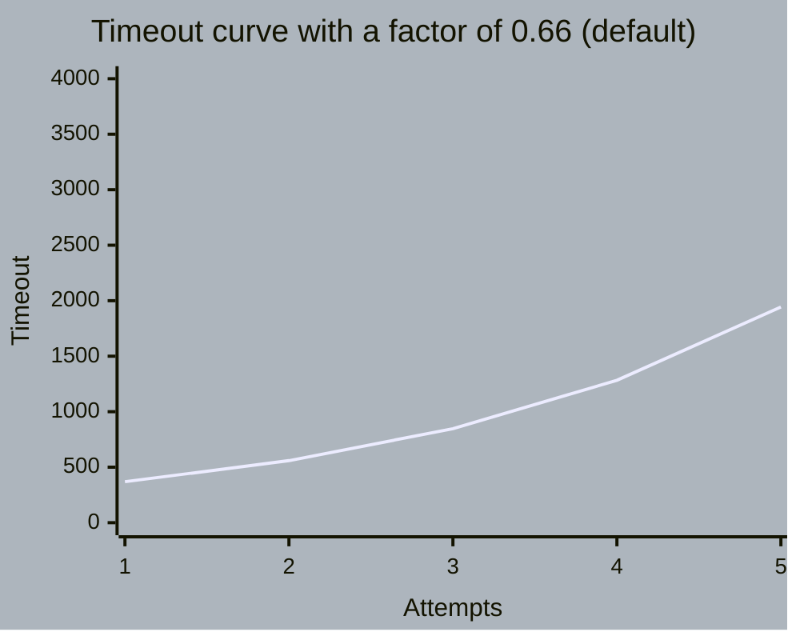
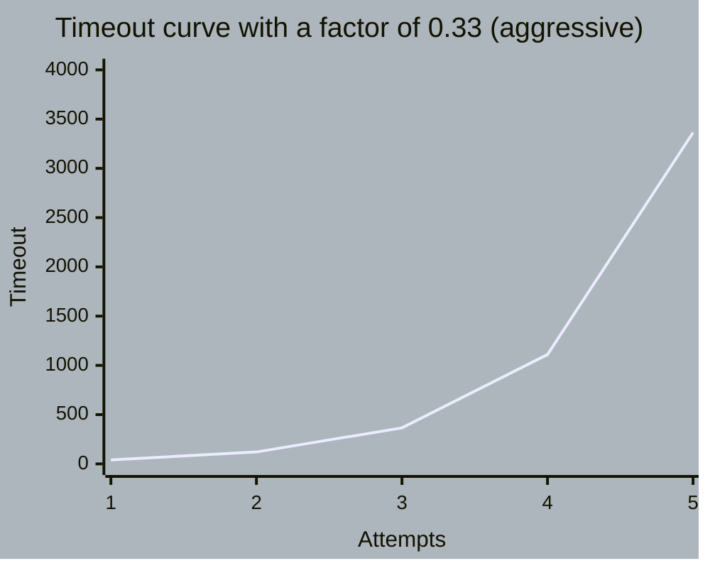

# TRY AGAin - your default retry with backoff in Erlang.

#### Usage example:
```
    %% The function that we want to retry until a certain condition is met.
    Function = fun() -> rand:uniform(1000) end,

    %% The condition we'll apply on the result to evaluate the outcome.
    %% While it will evaulate to false we will keep on retrying.
    Predicate = fun(Result) -> Result rem 2 == 0 end,

    %% 5 is the number of attempts or retries to make and 5000 is the 
    %% total duration, in milliseconds, that we want to wait, meaning that
    %% the total sum of all retry timeouts will be ≈5000 milliseconds.
    tryaga:retry(Function, Predicate, 5, 5000).
```

#### Default timeout curve in a configuration of 5 attempts with a total duration of 5000 milliseconds:


#### Aggressive timeout curve in a configuration of 5 attempts with a total duration of 5000 milliseconds:


