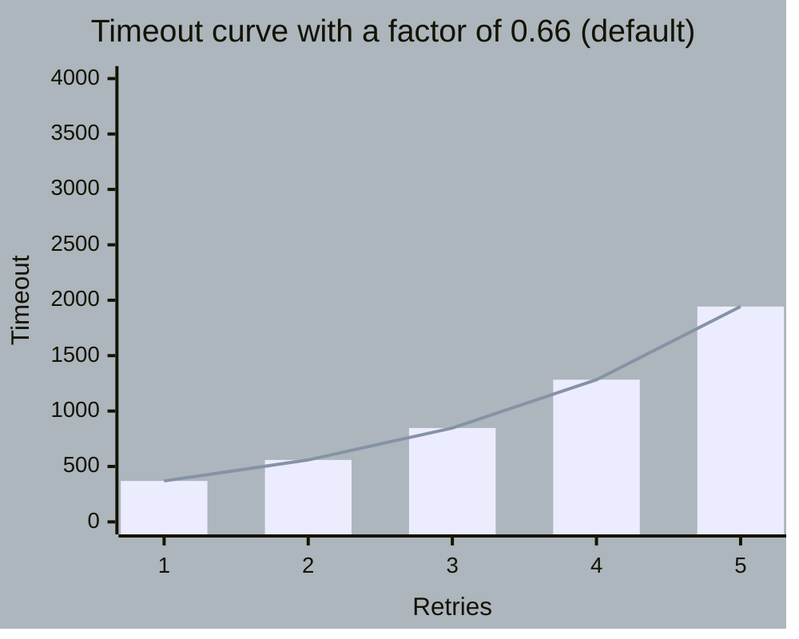
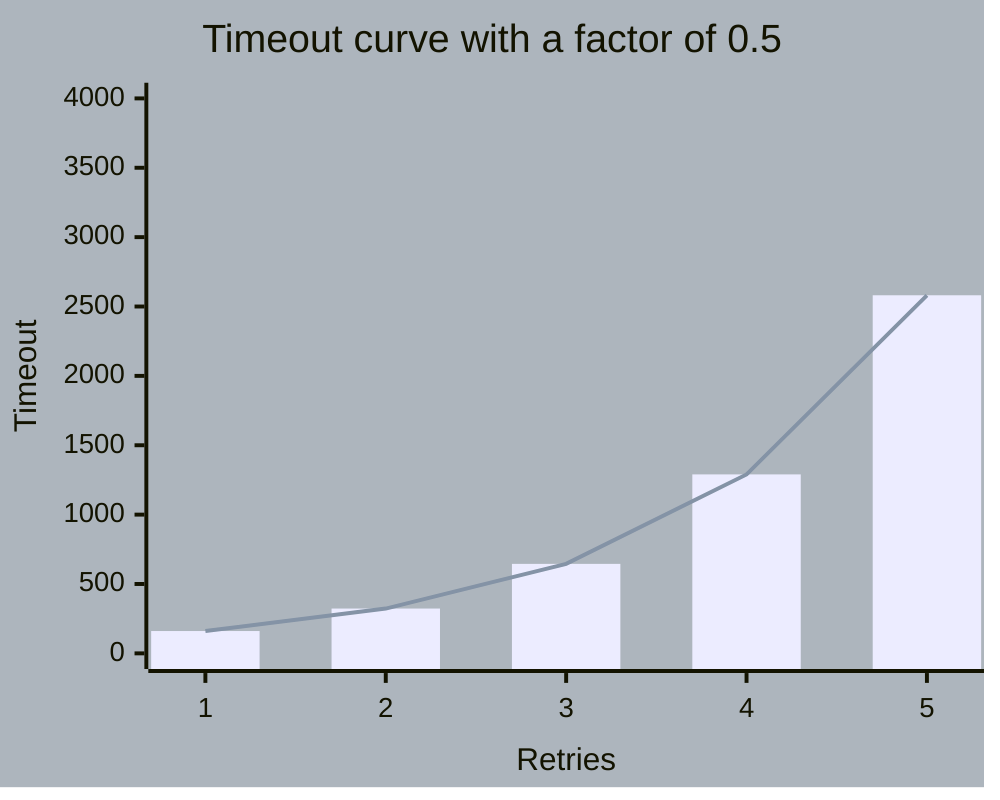
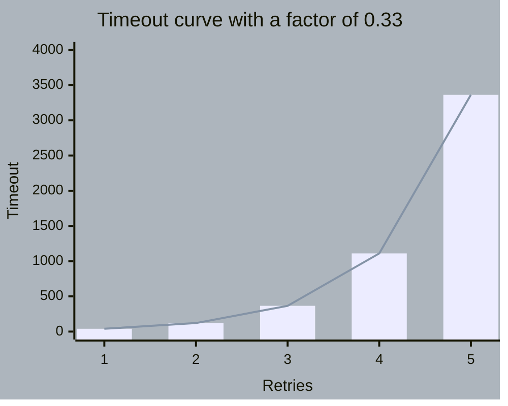

# TRY AGAin - your default retry with backoff and jitter in Erlang.

## Usage example:
```
Function = fun() -> rand:uniform(1000) end,
Predicate = fun(Result) -> Result rem 2 == 0 end,
Configuration = #{
    duration => 5000,
    retries => 5,
    factor => 0.33,
    jitter => 0,
    logger => fun(_Result, Timeout, _Configuration) -> io:format("Timeout :: ~p~n", [Timeout]) end
},
tryaga:apply(Function, Predicate, Configuration).

%% Run #1 (fail on 5th retry).
Timeout :: 40
Timeout :: 121
Timeout :: 366
Timeout :: 1110
Timeout :: 3363
{error,1}

%% Run #2 (pass on 5th retry).
Timeout :: 40
Timeout :: 121
Timeout :: 366
Timeout :: 1110
Timeout :: 3363
{ok,722}

Run #3 with a 10 percent jitter (fail on 5th retry).
tryaga:apply(Function, Predicate, Configuration#{jitter => 0.1}).
Timeout :: 39
Timeout :: 111
Timeout :: 332
Timeout :: 1013
Timeout :: 3058
{error,1}
```

## Configuration definition:
| Property  | Definition | Example | Default | Range |
| ------------- | ------------- | ------------- | ------------- | ------------- |
| duration  | Total time delegated for retrying a call, in milliseconds  | 5000 | - | - |
| retries  | Total number of retries to attempt  | 5 | 0 | - |
| factor  | Timeout growth ratio between retries, in percent  | 0.33 | 0.66 | 0.00 - 0.99 |
| jitter  |  Timeout portion to use for randomness, in percent | 0.1 | 0.00 | 0.00 - 1.00 |
| logger  | Function to use to log retry result, timeout and configuration | See usage example. | fun(_R, _T, _C) -> ok end. | - |

## Exported API:
```
main:
    %% to use all available configuration params e.g. factor and jitter
    tryaga:apply/3 => tryaga:apply(Function, Predicate, Configuration).

    %% simplified version which uses the default factor and jitter configuration
    tryaga:apply/4 => tryaga:apply(Function, Predicate, Retries, Duration).

utility:
    %% computes and returns a list of timeouts for given configuration, used to
       understand if the configuration you made meets your needs
    tryaga:describe/1 => tryaga:describe(Configuration).
```

## A few fancy graphs depicting the timeout curve based on different factor values:
### Configuration of 5 retries with a total duration of 5000 milliseconds without jitter.

#### Factor 0.66, this is the default value hardcoded in TRYAGA:


#### Factor 0.5, timeouts approximately double after each retry:



#### Factor 0.33, timeouts are lower at the beginning but grow significatly on later attempts:

