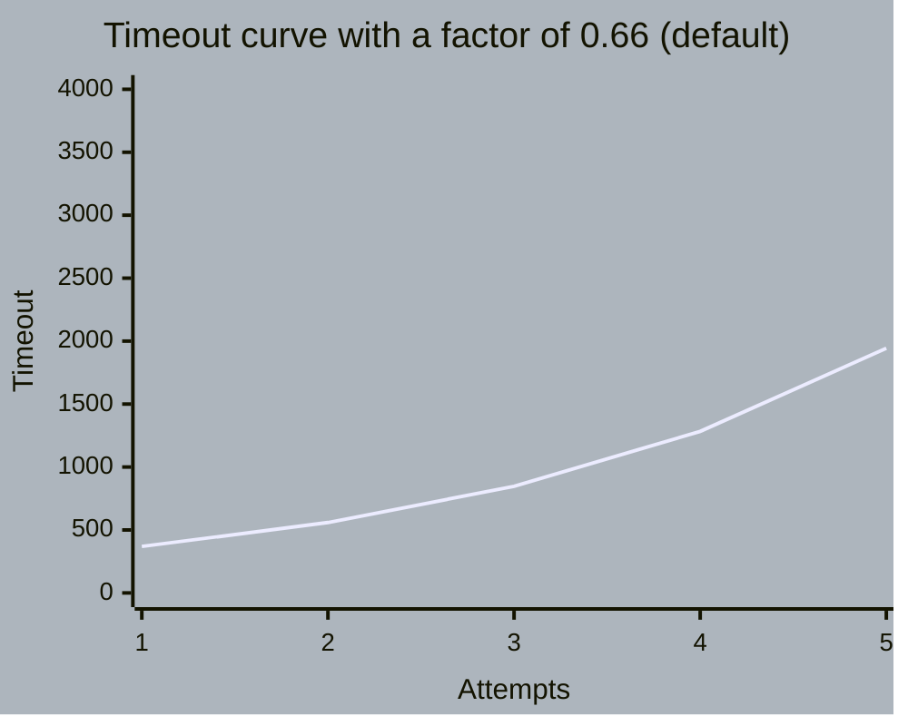
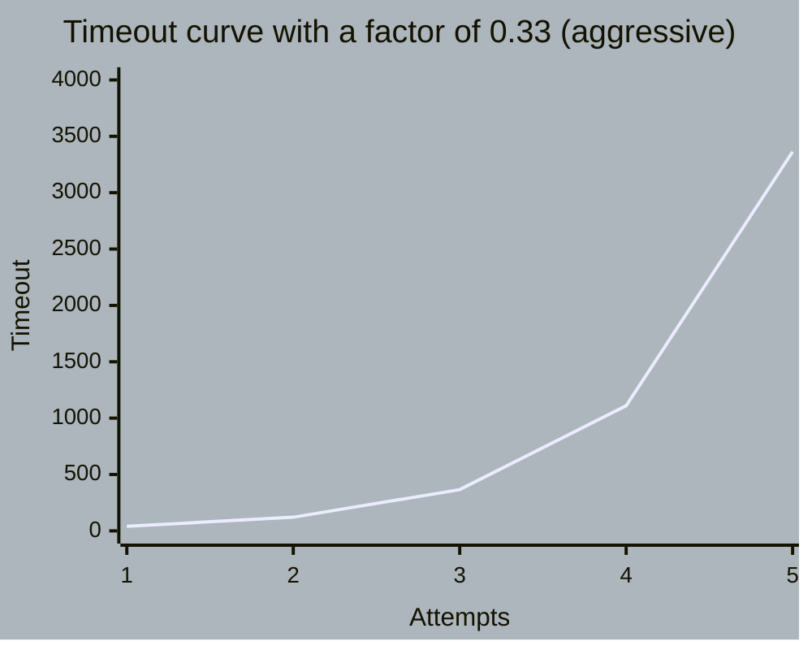

# TRY AGAin - your default retry with backoff in Erlang.

### Default timeout curve in a configuration of 5 attempts with a total duration of 5000 milliseconds:

### Aggressive timeout curve in a configuration of 5 attempts with a total duration of 5000 milliseconds:

